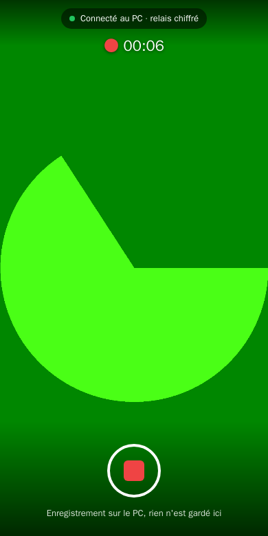
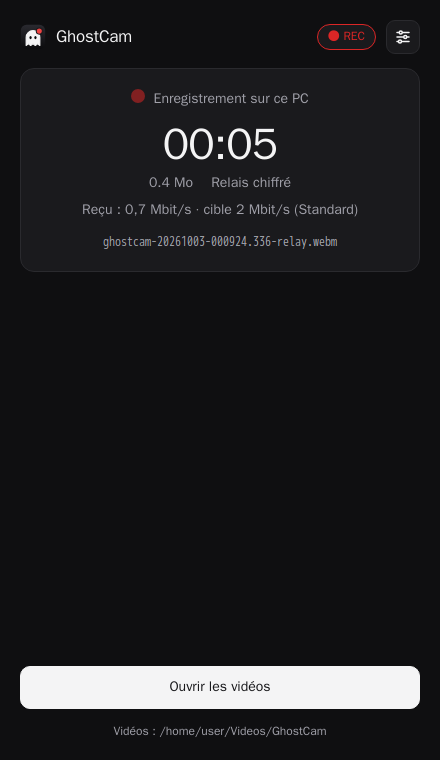
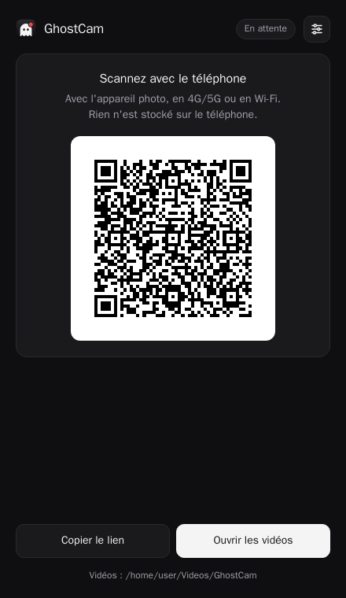
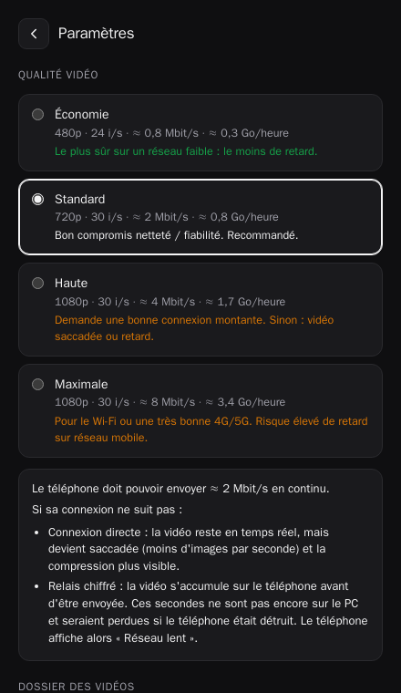
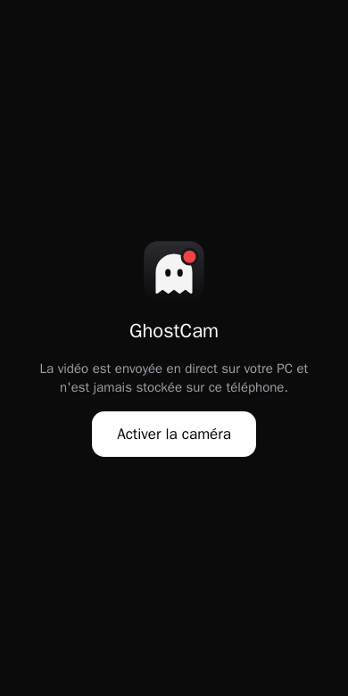

<p align="center">
  
</p>

<h1 align="center">GhostCam</h1>

<p align="center">
  <a href="README.md">English</a> · <b>Français</b>
</p>

<p align="center">
  <sub>Fait avec ❤️ en France 🇫🇷</sub>
</p>

<p align="center">
  <b>Votre téléphone filme, votre PC garde la preuve.</b><br>
  Envoyez la caméra d'un téléphone vers votre propre ordinateur, où qu'il soit (4G/5G, n'importe quel Wi-Fi), avec écriture sur le disque en temps réel.
  Rien n'est jamais stocké sur le téléphone.
</p>

## Démarrer en 3 étapes

**1. Sur votre ordinateur :** téléchargez GhostCam et ouvrez-le.

- **Windows 10/11 :** [`ghostcam.exe`](https://github.com/p3374/GhostCam/releases/latest/download/ghostcam.exe) (ou [`ghostcam-cli.exe`](https://github.com/p3374/GhostCam/releases/latest/download/ghostcam-cli.exe) pour la [ligne de commande](#ligne-de-commande)). Si SmartScreen indique une application non reconnue, cliquez sur *Informations complémentaires → Exécuter quand même*. Quand le pare-feu le demande, cliquez sur *Autoriser*.
- **macOS** *(expérimental)* : [Apple Silicon (M1 et suivants)](https://github.com/p3374/GhostCam/releases/latest/download/ghostcam-macos-apple-silicon) ou [Intel](https://github.com/p3374/GhostCam/releases/latest/download/ghostcam-macos-intel). Puis, dans le Terminal :
  ```sh
  cd ~/Downloads && chmod +x ghostcam-macos-* && xattr -c ghostcam-macos-* && ./ghostcam-macos-apple-silicon
  ```
  (utilisez `./ghostcam-macos-intel` sur un Mac Intel). L'app s'ouvre dans votre navigateur.
- **Linux** *(expérimental)* : [x64](https://github.com/p3374/GhostCam/releases/latest/download/ghostcam-linux-x64) ou [ARM64](https://github.com/p3374/GhostCam/releases/latest/download/ghostcam-linux-arm64). Puis `chmod +x ghostcam-linux-x64 && ./ghostcam-linux-x64`. L'app s'ouvre dans votre navigateur.

**2. Sur votre téléphone :** scannez le QR code affiché sur le PC avec l'appareil photo, puis appuyez sur **Activer la caméra**.
Ça marche sur iPhone (Safari) et Android (Chrome), en 4G/5G ou sur n'importe quel Wi-Fi. Rien à installer.

**3. Filmez :** appuyez sur le bouton rouge pour démarrer, et appuyez de nouveau pour arrêter. Autant de fois que vous voulez.
Chaque vidéo est enregistrée sur l'ordinateur, dans `Vidéos/GhostCam` (`Films/GhostCam` sur Mac). Le bouton **Ouvrir les vidéos** les affiche.

<p align="center">
  
  &nbsp;&nbsp;
  
</p>

### Bon à savoir

- **Rien n'est stocké sur le téléphone.** Chaque seconde filmée est déjà sur le PC. Si le téléphone est perdu, cassé ou éteint en pleine vidéo, le fichier reste lisible.
- **Réseau mobile lent ?** Choisissez **Économie** dans les paramètres (bouton en haut à droite), ou activez le **tampon réseau** pour que les coupures courtes ne figent plus la vidéo.
- **Gardez la page caméra ouverte** sur le téléphone : sur iPhone, passer à une autre app coupe la caméra.
- **Premier lancement :** l'app télécharge le connecteur Cloudflare (environ 50 Mo), le PC doit donc être connecté à Internet une fois.
- **Mises à jour :** quand une nouvelle version sort, une bannière propose de l'installer en un clic. GhostCam se remplace et redémarre, puis le téléphone scanne le nouveau QR code. Les versions antérieures à 1.3.0 ne savent pas se mettre à jour seules : téléchargez la 1.3.0 une fois.

### Problèmes courants

- **Le QR code n'apparaît pas :** l'app en indique la raison. Vérifiez la connexion Internet de l'ordinateur. Logs : `%LOCALAPPDATA%\GhostCam\ghostcam.log` (Windows), `~/Library/Application Support/GhostCam/ghostcam.log` (macOS), `~/.config/GhostCam/ghostcam.log` (Linux).
- **Le téléphone affiche « relais chiffré » au lieu de « direct » :** c'est normal et ça fonctionne. Le mode direct est plus léger ; il demande l'UPnP activé sur votre box.
- **« Lien d'appairage invalide » sur le téléphone :** scannez de nouveau le QR code. Un nouveau code est créé à chaque lancement de l'app.
- **Autre chose ?** [Ouvrez une issue](https://github.com/p3374/GhostCam/issues) en indiquant votre modèle de téléphone, votre navigateur et le système de votre ordinateur.

---

# Sous le capot

## Pourquoi GhostCam ?

Si un téléphone est confisqué, cassé ou éteint, ce qu'il a enregistré en local
peut être perdu. GhostCam en fait une **caméra distante sans stockage local** :
chaque image part directement vers un PC que vous contrôlez, et chaque seconde
reçue est déjà sur son disque.

- **Rien à installer sur le téléphone.** On scanne un QR code et la page caméra s'ouvre dans Safari (iOS) ou Chrome (Android).
- **Fonctionne entre réseaux différents.** Téléphone en 4G/5G dehors, PC à la maison derrière sa box : pas de redirection de port, pas de compte, pas de serveur à louer.
- **Résiste à une coupure brutale.** Les fichiers sont écrits au fil de l'eau et restent lisibles si le téléphone disparaît en pleine vidéo.
- **Chiffré de bout en bout.** Ni le tunnel ni aucun relais ne peut lire la vidéo, injecter des images, ni démarrer ou arrêter un enregistrement.
- **Un seul fichier, léger.** Un exécutable Windows d'environ 13 Mo écrit en Go. `cloudflared` est téléchargé, vérifié et mis à jour automatiquement. L'interface est une fenêtre native WebView2.
- **Open source**, donc auditable, ce qui est indispensable pour un outil de ce genre.

## Fonctionnalités

| Sur le téléphone | Sur le PC |
|---|---|
| Un bouton pour démarrer et arrêter, autant de vidéos que vous voulez | Un fichier par vidéo, chrono en direct, débit reçu |
| Aperçu en direct, rien n'est envoyé entre deux vidéos (économise données et batterie) | Préréglages de qualité avec avertissements sur la latence |
| Reconnexion automatique : si le réseau coupe en pleine vidéo, l'enregistrement reprend dans un nouveau fichier | Choix du dossier d'enregistrement (sélecteur de dossier natif) |
| Écran maintenu allumé (Wake Lock) | Appairage par QR code ou « Copier le lien » |
| État clair : connexion directe, relais chiffré, réseau lent | Fonctionne aussi sans fenêtre (`-headless`, QR code dans le terminal) |

<p align="center">
  
  &nbsp;
  
  &nbsp;
  
</p>

WebView2 est préinstallé sur Windows 10/11. S'il manque, GhostCam ouvre la même
page dans votre navigateur par défaut.

## Fonctionnement

```
 Téléphone (4G, CGNAT)                     Internet                       PC à la maison (derrière la box)
 ┌──────────────┐  HTTPS/WSS  ┌──────────────────────────┐  QUIC sortant   ┌─────────────────────┐
 │ Page web     │────────────▶│ Cloudflare Quick Tunnel  │◀───────────────│ cloudflared (enfant)│
 │ getUserMedia │ signaling   │ https://xxx.trycloudflare│                 │ ghostcam            │
 │ RTCPeerConn. │             └──────────────────────────┘                 │  :8080 public (lo)  │
 │              │                                                          │  :8081 admin  (lo)  │
 │              │════════ Média WebRTC, DTLS-SRTP, UDP ═══════════════════▶│  :50000/udp (ICE)   │
 └──────────────┘   1. IP publique:50000 ouverte par UPnP (direct)         │  → *.webm sur disque│
                    2. Perçage du NAT par STUN (direct)                    └─────────────────────┘
                    3. Relais TURN (facultatif, votre serveur)
                    4. Secours : morceaux MediaRecorder chiffrés AES-GCM, via le tunnel WSS
```

- **Le signaling et la page du téléphone** passent par un Cloudflare Quick Tunnel
  que l'app lance elle-même. `cloudflared` n'établit que des connexions sortantes,
  et le téléphone obtient une URL HTTPS valide, que les navigateurs exigent pour
  accéder à la caméra.
- **La vidéo** passe en WebRTC sur un seul port UDP fixe. L'app demande à la box
  d'ouvrir ce port par **UPnP** et transmet son adresse publique au téléphone
  comme candidat ICE supplémentaire : le téléphone peut ainsi joindre le PC
  directement, même derrière le NAT d'un opérateur mobile. Sans UPnP, le perçage
  du NAT par STUN fonctionne souvent. Un serveur TURN facultatif couvre les cas
  restants.
- **Secours** : si aucun chemin WebRTC ne s'établit en environ 12 s, le téléphone
  bascule sur des morceaux `MediaRecorder` envoyés chaque seconde par le même
  WebSocket, chiffrés de bout en bout. Ce chemin fonctionne dès que la page se
  charge.
- **Appairage et enregistrement** : un appairage garde une connexion ouverte.
  Chaque Rec/Stop produit un fichier. Les commandes de démarrage et d'arrêt
  passent par un DataChannel WebRTC, ou à l'intérieur des trames chiffrées du
  relais.

## Binaire du tunnel (cloudflared)

GhostCam ne livre pas `cloudflared`. À chaque lancement, il consulte les
releases GitHub officielles de Cloudflare et installe ou met à jour sa propre
copie dans `%LOCALAPPDATA%\GhostCam\bin\` :

- Un téléchargement n'est accepté que si son **SHA-256** correspond à
  l'empreinte publiée par GitHub pour ce fichier (et à celle que Cloudflare
  liste dans ses notes de version, quand elle y figure), et s'il porte une
  **signature Authenticode valide de « Cloudflare, Inc. »**. Ce contrôle de
  signature ne dépend pas de GitHub.
- À chaque lancement, l'empreinte du binaire installé est recalculée. S'il a été
  modifié, il est réinstallé.
- **Hors ligne**, la copie installée est utilisée telle quelle. Si la mise à
  jour échoue, la version précédente est conservée.
- `cloudflared` tourne dans un Job Object Windows : il s'arrête avec GhostCam,
  même en cas de crash ou d'arrêt forcé.
- Le QR code n'apparaît qu'une fois la page du téléphone réellement chargée via
  le tunnel (résolution par 1.1.1.1, pour ne pas polluer le cache DNS de la box).

`-cloudflared <chemin>` court-circuite tout cela et utilise votre propre binaire.

## Ligne de commande

La ligne de commande fonctionne sous Windows, macOS et Linux :

| Système | Fichier à utiliser |
|---|---|
| Windows | [`ghostcam-cli.exe`](https://github.com/p3374/GhostCam/releases/latest/download/ghostcam-cli.exe), un téléchargement à part : `ghostcam.exe` est une application fenêtrée et n'affiche rien dans un terminal |
| macOS | Le binaire habituel (`ghostcam-macos-apple-silicon` ou `ghostcam-macos-intel`) |
| Linux | Le binaire habituel (`ghostcam-linux-x64` ou `ghostcam-linux-arm64`) |

Sous macOS et Linux, le même binaire fait les deux : sans argument il ouvre
l'interface, avec une commande il reste dans le terminal.

Commandes :

| Commande | Rôle |
|---|---|
| `ghostcam run` | Démarre dans le terminal : QR code et statut en direct (attente, connecté, ● REC, taille, retard) |
| `ghostcam config` | Affiche les réglages |
| `ghostcam config set CLÉ VALEUR` | Change un réglage, appliqué tout de suite si GhostCam tourne. Clés : `quality`, `buffer`, `out`, `tunnel`, `tunnel-url`, `language`, `updates` |
| `ghostcam config get CLÉ` | Affiche un réglage |
| `ghostcam update [--check]` | Installe la dernière version (`--check` : regarde seulement) |
| `ghostcam version` | Affiche la version |

Le terminal parle les mêmes langues que la fenêtre (mêmes fichiers de
traduction). Si la sortie est redirigée (logs, Docker), il affiche une ligne par
changement.

## Lien Internet (tunnel)

Le téléphone joint l'ordinateur par une adresse HTTPS publique. Dans
Paramètres → *Lien Internet* (ou `ghostcam config set tunnel …`) :

| Choix | Fonctionnement |
|---|---|
| **Cloudflare** (par défaut) | Cloudflare Quick Tunnel : sans compte ; `cloudflared` est téléchargé, vérifié et mis à jour automatiquement |
| **localhost.run** | Tunnel SSH intégré à GhostCam : rien à télécharger, sans compte. L'adresse gratuite change plus souvent, et la clé SSH du serveur est mémorisée à la première connexion |
| **Mon adresse perso** | N'importe quelle URL HTTPS que vous contrôlez et qui redirige vers `127.0.0.1:8080` sur cet ordinateur : ngrok, Tailscale Funnel, un tunnel Cloudflare nommé, Caddy ou nginx sur votre serveur… |

Changer de lien le relance aussitôt, avec un nouveau QR code. Si le tunnel
coupe, GhostCam se reconnecte tout seul.

## Mises à jour

GhostCam consulte la dernière release GitHub au démarrage, puis toutes les
6 heures. On peut désactiver cette vérification dans les Paramètres, ou la
lancer à la main avec *Rechercher maintenant*. Quand une version plus récente
existe, une bannière propose de l'installer :

1. Le binaire de ce système est téléchargé à côté de l'exécutable.
2. Il n'est accepté que s'il vient de l'adresse de téléchargement des releases
   de ce dépôt, a la taille annoncée et correspond à l'**empreinte SHA-256
   publiée par GitHub**.
3. L'exécutable en cours est remplacé. L'ancien est gardé en `.old` jusqu'à ce
   que la nouvelle version ait tourné une minute.
4. GhostCam redémarre. La nouvelle instance attend que l'ancienne ait fermé ses
   enregistrements et libéré ses ports.

Une mise à jour est refusée pendant un enregistrement.

## Modèle de sécurité

| Menace | Protection |
|---|---|
| Quelqu'un d'autre se connecte | Secret de 256 bits dans le **fragment** de l'URL du QR code (`#t=`). Les navigateurs n'envoient jamais le fragment sur le réseau. Le téléphone prouve qu'il connaît le secret par un HMAC(nonce du serveur, offre SDP). |
| Le tunnel ou le TURN se fait passer pour le PC | L'empreinte du certificat DTLS du PC est épinglée dans le QR code (`&f=`), et le téléphone rejette toute autre réponse. |
| Le tunnel lit ou modifie la vidéo | Le média WebRTC est en DTLS-SRTP de bout en bout. Les trames du relais, trames de contrôle comprises, sont chiffrées en AES-256-GCM avec AAD = nonce‖seq : impossible de les rejouer, de les réordonner ou d'en supprimer sans que ce soit détecté. |
| Un site web lit le secret depuis localhost | L'interface admin n'écoute qu'en local, n'est jamais exposée par le tunnel, vérifie l'en-tête Host (DNS rebinding) et exige un en-tête spécifique pour toute action qui modifie quelque chose. |
| WebSocket intersite ou injection de script | L'Origin doit correspondre au Host, et la page du téléphone a une CSP stricte. |

**Limite connue :** c'est le tunnel qui sert la page du téléphone, donc un
opérateur de tunnel malveillant pourrait servir un JavaScript modifié. Pour
supprimer cette confiance, il faudrait héberger `web/` sur une origine statique
que vous contrôlez et n'utiliser le tunnel que pour `/ws`. Contributions
bienvenues.

## Format d'enregistrement

- **Direct (WebRTC) :** VP8 + Opus en **WebM avec Segment et Clusters de taille
  inconnue**, écrit à l'arrivée des paquets et synchronisé sur le disque chaque
  seconde. Une coupure brutale laisse un fichier lisible (VLC, mpv, ffmpeg,
  navigateurs).
- **Relais :** le flux MediaRecorder du téléphone lui-même : WebM sur
  Chrome/Android, WebM ou MP4 sur Safari selon la version. Le WebM tolère les
  coupures. Après une coupure brutale, un MP4 Safari peut nécessiter
  `ffmpeg -i in.mp4 -c copy out.mp4`.
- Les fichiers sont écrits en direct, donc sans index de navigation. Pour pouvoir
  avancer facilement dans la vidéo : `ffmpeg -i in.webm -c copy fixed.webm`.
- Noms : `ghostcam-<date>-<webrtc|relay>.<ext>`.

### Préréglages de qualité

Ils se règlent dans le panneau Paramètres, sont enregistrés dans
`%LOCALAPPDATA%\GhostCam\settings.json`, et s'appliquent dès la vidéo suivante
sans reconnecter le téléphone.

| Préréglage | Caméra | Débit montant nécessaire | Disque |
|---|---|---|---|
| Économie | 480p 24 i/s | ≈ 0,8 Mbit/s | ≈ 0,3 Go/h |
| Standard (par défaut) | 720p 30 i/s | ≈ 2 Mbit/s | ≈ 0,8 Go/h |
| Haute | 1080p 30 i/s | ≈ 4 Mbit/s | ≈ 1,7 Go/h |
| Maximale | 1080p 30 i/s | ≈ 8 Mbit/s | ≈ 3,4 Go/h |

Si le débit montant du téléphone est inférieur à ce que demande le préréglage :
- **Direct :** la vidéo reste en temps réel mais perd des images (`degradationPreference: maintain-resolution`).
- **Relais :** les données s'accumulent sur le téléphone, ce qui veut dire que ces secondes ne sont **pas encore en sécurité sur le PC**.

La fenêtre du PC affiche le débit reçu et prévient quand il tombe sous la moitié
de la cible.

### Tampon réseau

Désactivé par défaut (temps réel). Avec un tampon de 5, 15 ou 30 s (Paramètres),
le téléphone enregistre avec `MediaRecorder` à pleine fluidité et envoie les
morceaux par un canal fiable (le DataChannel WebRTC, ou le relais chiffré) :

- Une coupure réseau **retarde** la vidéo au lieu de la figer.
- Les morceaux en attente restent **uniquement en mémoire** dans la page, jamais
  dans le stockage du téléphone. Ils seraient perdus si le téléphone était
  détruit, c'est pourquoi le tampon est à activer volontairement.
- Le téléphone et le PC affichent le retard. En mode relais, il est mesuré à
  partir des accusés de réception du PC, car la page ne voit pas les tampons TCP du système.
- Quand le retard dépasse le tampon, le téléphone baisse la qualité d'un cran,
  dans un nouveau fichier. Si même Économie est trop lourd pour le réseau, le
  retard continue d'augmenter, et l'affichage l'indique.
- L'arrêt est immédiat : les dernières secondes continuent de partir en
  arrière-plan, et le téléphone confirme quand le PC a tout reçu.

---

# Pour les développeurs

## Compilation

Tout se compile dans Docker. Il suffit d'avoir Docker et Docker Compose sur la machine.

```sh
git clone https://github.com/p3374/GhostCam.git && cd GhostCam
docker compose run --rm build-windows   # -> dist/ghostcam.exe (un seul fichier, licences intégrées)
docker compose run --rm build-release   # -> tous les binaires de release (Windows, macOS, Linux) + SHA256SUMS.txt
docker compose up dev                   # dev dans un conteneur : QR code dans les logs, admin sur http://localhost:8081
docker compose run --rm icons           # régénère les icônes depuis web/icon.svg (PNG + ressource Windows .syso)
```

Lancez le `.exe` directement sous Windows : UPnP et l'UDP direct ont besoin du
réseau de la machine. Dans Docker, seul le relais chiffré fonctionne (et parfois
STUN).

### Options de ligne de commande

| Option | Défaut | Rôle |
|---|---|---|
| `-out <dossier>` | réglage enregistré | Dossier des vidéos (remplace le réglage) |
| `-rtc-port <n>` | `50000` | Port UDP pour WebRTC (ouvert par UPnP) |
| `-no-upnp` | désactivé | Ne pas toucher à la box |
| `-tunnel <fournisseur>` | réglage enregistré | `cloudflare` ou `localhostrun` pour ce lancement |
| `-public-url <url-https>` | réglage enregistré | Votre propre adresse pour ce lancement (voir [Lien Internet](#lien-internet-tunnel)) |
| `-cloudflared <chemin>` | téléchargé et mis à jour automatiquement | Utiliser ce binaire cloudflared à la place |
| `-stun <urls>` | Cloudflare + Google | Serveurs STUN séparés par des virgules ; vide = STUN désactivé |
| `-turn <url> -turn-user <u>` | aucun | Serveur TURN ; mot de passe via `GHOSTCAM_TURN_PASS` |
| `-headless` | désactivé | Pas de fenêtre : QR code et statut dans le terminal (comme `ghostcam run`) |
| `-web-dir <dossier>` | intégré | Sert `web/` depuis le disque (modification en direct) |

Les logs sont écrits dans `%LOCALAPPDATA%\GhostCam\ghostcam.log`.

## Langues

L'interface est disponible en **anglais** et en **français** :
- La page du téléphone suit la langue de son navigateur.
- La fenêtre PC suit la langue du système, ou le choix fait dans Paramètres → *Langue*.
- Pour une langue non disponible, l'anglais est utilisé.

Les traductions sont dans [`web/locales/`](web/locales), un fichier par langue
au format **i18next JSON v4** (clés hiérarchiques, `{{variables}}`, formes de
pluriel CLDR comme `_one` / `_many` / `_other`). `en.json` est la source. Ce
format fonctionne tel quel avec Weblate, Crowdin, Lokalise et les outils
similaires. Pour ajouter une langue, voir
[CONTRIBUTING.md](CONTRIBUTING.md#translations).

## Tests

Un test de bout en bout utilise un Chromium sans interface, avec une fausse
caméra, dans le rôle du téléphone. Il enregistre 3 vidéos, change la qualité et
le dossier en cours de session, puis tue le navigateur en pleine vidéo
(téléphone « détruit »). Il ne réussit que si ffmpeg arrive à décoder chaque
fichier.

```sh
docker compose run --rm build-linux
MODE=webrtc docker compose run --rm e2e                   # chemin direct
MODE=relay  docker compose run --rm e2e                   # UDP bloqué : relais chiffré
MODE=webrtc docker compose run --rm -e QUALITY2=high e2e  # qualité en hausse plutôt qu'en baisse
LOCALE=en-US docker compose run --rm e2e                  # téléphone et fenêtre PC en anglais (défaut : fr-FR)
BUFFER=5 docker compose run --rm e2e                      # tampon réseau activé
BUFFER=5 RATE=300kbit QUALITY1=high docker compose run --rm e2e  # réseau bridé : retard, baisse de qualité, rien de perdu
docker compose run --rm i18n                              # fichiers de traduction : clés, pluriels, variables
docker compose run --rm --no-deps dev go test ./internal/... # tests unitaires (mise à jour, extraction d'archive)
# mise à jour automatique de bout en bout : un faux GitHub sert la 1.3.1 à une 1.3.0 en cours
VERSION_OVERRIDE=1.3.0 OUT_NAME=ghostcam-old docker compose run --rm build-linux
VERSION_OVERRIDE=1.3.1 OUT_NAME=ghostcam-new docker compose run --rm build-linux
docker compose run --rm selfupdate
```

Pour chaque fichier, le test affiche le nombre d'images et la résolution de la
première et de la dernière image.

## Organisation du projet

```
cmd/ghostcam/        point d'entrée : sous-commandes (cli.go), interface terminal (term.go), tunnels, UPnP, mises à jour ; fenêtre native (gui_windows.go)
internal/server/     HTTP (public + admin), signaling WebSocket, session WebRTC, relais chiffré, réglages
internal/record/     fichier en ajout seul synchronisé sur disque, multiplexeur WebM en direct
internal/pairing/    secret d'appairage, authentification HMAC, déchiffrement AES-GCM des trames
internal/tunnel/     tunnels : Cloudflare Quick Tunnel, localhost.run (SSH, intégré), URL perso
internal/upnp/       ouverture du port sur la box + renouvellement du bail
internal/update/     mise à jour automatique : vérification, téléchargement vérifié, remplacement, redémarrage
web/                 page du téléphone (index.html, app.js), fenêtre PC (admin.html), i18n.js, icône (intégrées au binaire)
web/locales/         traductions, i18next JSON v4 (en.json = source)
notices.go           intègre LICENSE + third_party_licenses.txt (affichés dans l'app)
scripts/             gen-notices.sh : régénère third_party_licenses.txt
test/e2e/            test de bout en bout Playwright
test/i18n/           contrôle de cohérence des traductions
test/update/         test de bout en bout de la mise à jour automatique
VERSION              version intégrée aux binaires (comparée à la dernière release)
```

## Problèmes connus et feuille de route

Bons points d'entrée pour contribuer :

- **Échec occasionnel de la connexion directe.** Lors de tests avec de nombreuses reconnexions rapides, environ 1 tentative sur 8 n'a pas réussi en direct et a basculé sur le relais après environ 12 s. Cause pas encore identifiée.
- **iOS en arrière-plan.** iOS coupe la caméra quand Safari passe en arrière-plan. La page se reconnecte avec une caméra relancée à son retour, mais ce n'est pas encore testé sur un vrai iPhone.
- **Résolution en mode relais.** La baisse de qualité est confirmée en mode direct. En mode relais, avec la fausse caméra de Chromium, MediaRecorder a gardé la résolution native. C'est à vérifier sur de vrais téléphones.
- **Page du téléphone auto-hébergée**, pour ne plus avoir à faire confiance au tunnel pour le JavaScript (voir le Modèle de sécurité).
- **macOS et Linux sont expérimentaux.** Ils utilisent le navigateur au lieu d'une fenêtre native. Le téléchargement de cloudflared pour macOS (archive `.tgz`) est testé sur les vraies archives de Cloudflare, mais GhostCam n'a pas encore tourné sur un vrai Mac : les retours sont bienvenus. Le binaire macOS n'est pas notarisé, d'où l'étape `xattr`.
- **Tests unitaires et CI.** Il n'y a aujourd'hui que le test de bout en bout.
- **Plus de langues.** L'anglais et le français sont disponibles : les traductions sont les bienvenues (voir [Langues](#langues)).
- **ICE restart**, plutôt qu'un nouveau fichier lors des coupures réseau courtes.
- **Index de navigation à l'arrêt**, par remultiplexage pour ajouter des Cues et permettre aux lecteurs d'avancer dans la vidéo.

## Contribuer

Les contributions sont les bienvenues : les retours d'expérience sur de vrais
réseaux (opérateur, modèle de box, téléphone et navigateur) valent autant que du
code. Ouvrez une [issue](https://github.com/p3374/GhostCam/issues) ou une pull
request, et consultez [CONTRIBUTING.md](CONTRIBUTING.md) (en anglais).

## Usage responsable

GhostCam enregistre la vidéo et le son. Les lois sur le fait de filmer des
personnes, d'enregistrer du son et d'utiliser des enregistrements comme preuve
varient selon les pays. Vous êtes responsable d'en faire un usage légal et de
respecter la vie privée d'autrui.

## Licence

GhostCam est un logiciel libre, sous licence
[GNU Affero General Public License v3.0 ou ultérieure](LICENSE) (`AGPL-3.0-or-later`).

En résumé :
- Vous pouvez l'utiliser, l'étudier, le modifier et le partager, commercialement ou non.
- Si vous **distribuez** une version modifiée (binaires ou sources), vous devez
  en rendre le code source complet disponible sous la même licence.
- Si vous laissez **d'autres personnes utiliser une version modifiée par le
  réseau**, par exemple en l'hébergeant comme service, vous devez aussi leur en
  proposer le code source (section 13 de l'AGPL).
- Les modifications privées, que vous ne distribuez pas et n'exposez à personne,
  n'entraînent aucune obligation.

Ce résumé n'est pas un avis juridique : seul le texte de la [LICENSE](LICENSE)
fait foi.

Les composants tiers gardent leur propre licence, toutes permissives et
compatibles avec l'AGPL-3.0 : MIT (pion, go-qrcode, go-webview2), BSD
(bibliothèque standard Go, golang.org/x, goupnp, uuid, anet), ISC
(coder/websocket, go-winloader) et Apache-2.0 (ebml-go). Leurs textes complets
sont intégrés à l'exécutable et consultables dans l'app (Paramètres → *Licences
open source*). `cloudflared` n'est pas distribué avec GhostCam : il est
téléchargé depuis Cloudflare à l'exécution, sous licence Apache-2.0.
